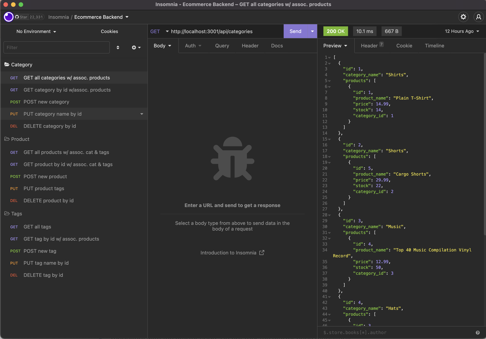

# E-Commerce Backend

## Description

Backend for an e-commerce site. Connecting Express.js API routes with Sequilize to interact with a MySQL database.

## Table of Contents

- [Installation](#installation)
- [Usage](#usage)
- [Routes](#routes)

## Installation

Pre-req: Latest Insomnia, MySQL, & NodeJS installed

1. Download zip or clone repository
2. Once open in VS Code, run `npm install` to download dependencies
3. Sign in to MySQL in terminal with `mysql -u root -p`, then run `source db/schema.sql` to create database
4. Create and configure `.env` file at the root of the project (DB_NAME='ecommerce_db, DB_USER='root', DB_PW='yourpassword`)

## Usage

1. Run `npm run seeds` to seed your database
2. Run `npm run start` to start server
3. Use Insomnia to test routes (List of routes below)

### Routes

#### Category Routes

- GET all categories (w/ assoc. products): /api/categories
- GET category by id (w/ assoc. products): /api/categories/:id (replace :id with category number)
- POST new category: /api/categories | JSON { "category_name": "new category here" }
- PUT (update) category name by id: /api/categories/:id (replace :id with category number) | JSON { "category_name": "updated name here" }
- DEL (delete) category name by id: /api/categories/:id (replace :id with category number)

#### Product Routes

- GET all products (w/ assoc. category & tags): /api/products
- GET product by id (w/ assoc. category & tags): /api/products/:id (replace :id with product number)
- POST new product: /api/products | JSON { "product_name": "new product here", "category_id": #, "price": #, "stock": #, "tagIds": [] }
- PUT (update) product tags by id: /api/products/:id (replace :id with product number) | JSON { "tagIds": [] }
- DEL (delete) product name by id: /api/products/:id (replace :id with product number)

#### Tag Routes

- GET all tags (w/ assoc. products): /api/tags
- GET tag by id (w/ assoc. products): /api/tags/:id (replace :id with tag number)
- POST new tag: /api/tags | JSON { "tag_name": "new tag here" }
- PUT (update) tag tags by id: /api/tags/:id (replace :id with tag number) | JSON { "tag_name": "updated tag name" }
- DEL (delete) tag name by id: /api/tags/:id (replace :id with tag number)

## License

## Questions

If you have any questions, you can reach me at:

- [GitHub: J0J0C0DING](https://github.com/J0J0C0DING)
- [joeyrebne.bootcamp@gmail.com](mailto:joeyrebne.bootcamp@gmail.com)
